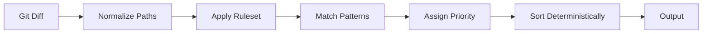

# PushBadger

PushBadger analyzes git diffs and maps changed files to risk areas using
deterministic, path-based heuristics. No AI, no network calls — just fast,
reproducible signal about which parts of your codebase a change touches.

## Why PushBadger exists

Modern CI/CD pipelines often rely on non-deterministic PR analysis tools that can introduce noise, break trust, and complicate auditability. When analysis results vary based on time, environment, or opaque models, they become unreliable for gating production changes.

PushBadger is built to be a deterministic alternative for:
- **CI Gating**: Reliable, repeatable risk signals to block or approve PRs.
- **Regression Detection**: Consistent mapping of changes to functional areas to spot unintended side effects.
- **Audit Environments**: A stable trail of risk assessment that remains identical across repeated runs.

## Where PushBadger fits in a pipeline

PushBadger ensures a consistent role as part of a CI/CD workflow. It operates purely on git diff output and does not require repository modification or external services.

Typical usage:

1. A pull request is opened or updated
2. CI generates a diff against the base branch
3. PushBadger analyzes the diff using the embedded ruleset
4. Output is used to:
   - gate merges (e.g. fail on high-risk changes)
   - annotate PRs
   - feed downstream automation

Because outputs are deterministic, results can be:
- cached
- compared across runs
- used as reliable inputs to other systems

- **Deterministic.** Same diff + same ruleset = byte-identical output.
- **Path-based.** Doublestar globs over lowercased file paths.
- **Self-contained.** Embedded default ruleset, single static binary, no runtime dependencies beyond `git`.

## Requirements

- Go 1.24+ (only required to build from source)
- `git` on `PATH`

## Install

### Installation Philosophy

PushBadger prioritizes reproducibility and stability. We currently do not support package managers to ensure that the exact version used in your CI pipeline is the one you intentionally built or downloaded. This "intentional installation" approach guarantees that your risk analysis remains consistent across all environments without silent updates.

### Option 1 — Build from source

```sh
git clone <repo-url> pushbadger
cd pushbadger
make build              # produces ./pushbadger
./pushbadger --version
```

Or without Make:

```sh
go build -o pushbadger ./cmd/pushbadger
```

### Option 2 — Install on `PATH`

After building, drop the binary somewhere on your `PATH`:

```sh
make build
sudo install -m 0755 pushbadger /usr/local/bin/pushbadger
pushbadger --version
```

### Option 3 — Download a release binary

Tagged releases (`v*`) are built by CI for `linux/amd64`, `darwin/arm64`, and
`darwin/amd64` and published to the GitHub Releases page. Download the matching
binary, `chmod +x` it, and move it onto your `PATH`.

> `go install` is not yet supported: the module is not published at a public
> import path. Use one of the options above.

## Quick start

```sh
cd your-repo
pushbadger analyze                         # diff vs auto-detected base
pushbadger analyze --staged                # what's about to be committed
pushbadger analyze --base main --format json   # machine-readable
```

## Usage

```
pushbadger analyze [flags]

Flags:
  --base string    Base ref for diff (default: auto-detected)
  --head string    Head ref for diff (default: HEAD)
  --staged         Diff staged changes  (HEAD → index)
  --working        Diff unstaged changes (index → worktree)
  --format string  Output format: text or json (default: text)
  --rules string   Path to custom rules YAML file (default: embedded ruleset)
```

## Example: CI usage

PushBadger is built for CI environments. A typical integration analyzes the difference between the current branch and the main branch:

```sh
# Ensure the base branch is present
git fetch origin main

# Analyze the diff against the base branch
pushbadger analyze --base origin/main
```

### Diff modes

Pick at most one mode group. Combining `--staged` or `--working` with
`--base`/`--head` exits 2 with a specific error message.

| Command | What it diffs |
|---|---|
| `pushbadger analyze` | `<resolved-base>...HEAD` |
| `pushbadger analyze --staged` | staged changes (HEAD → index) |
| `pushbadger analyze --working` | unstaged changes (index → worktree) |
| `pushbadger analyze --base X` | `X...HEAD` |
| `pushbadger analyze --head Y` | `<resolved-base>...Y` |
| `pushbadger analyze --base X --head Y` | `X...Y` |

### Base ref resolution

Resolved in this order; first hit wins:

1. `--base` flag, used as-is
2. `git symbolic-ref refs/remotes/origin/HEAD` (typically `origin/main`)
3. First of `main`, `master`, `trunk` that exists locally
4. Hard fail (exit 2) if nothing resolves

## How matching works



Each rule defines a named area, an integer priority, and a list of
[doublestar](https://github.com/bmatcuk/doublestar) glob patterns.

**Matching is purely rule-driven and does not depend on runtime state.**

On every run:

1. Changed files come from `git diff` (renamed files use the new path; deleted
   and binary files are tagged but still classified).
2. Every path is **lowercased** before pattern matching, so matching is
   case-insensitive.
3. Each file is tested against every rule. **A file may match multiple areas**
   and will appear in each one.
4. Files that match no rule are collected into the `unclassified` area, which
   is **always sorted last** regardless of priority.
5. Areas are sorted by priority (ascending), then by name for ties. Files
   inside an area are sorted by path.

### Real path examples

Against the [embedded default ruleset](config/risk_rules.yaml):

| File path | Matched area(s) | Pattern that matched |
|---|---|---|
| `services/payments/processor.go` | `payments` (10) | `**/payment*/**` |
| `internal/auth/login.go` | `auth` (20) | `**/auth/**`, `**/login*` |
| `db/migrations/0001_init.sql` | `db` (30) | `**/migration*/**`, `**/*.sql` |
| `pkg/auth/session_test.go` | `auth` (20), `tests` (70) | `**/auth/**` and `**/*_test.go` |
| `scripts/release.sh` | `unclassified` | none |

Expected text output for the five files above:

```
Risk analysis: main...HEAD

payments (1 file)
  services/payments/processor.go

auth (2 files)
  internal/auth/login.go
  pkg/auth/session_test.go

db (1 file)
  db/migrations/0001_init.sql

tests (1 file)
  pkg/auth/session_test.go

unclassified (1 file)
  scripts/release.sh

5 files, 5 areas
```

Note that `pkg/auth/session_test.go` appears in **both** `auth` and `tests`.
Because `auth` has lower priority (20) than `tests` (70), `auth` always
precedes `tests` in the output.

## Output formats

### Text

```
$ pushbadger analyze --base main

Risk analysis: main...HEAD

payments (1 file)
  internal/payments/checkout.go

auth (2 files)
  internal/auth/login.go
  internal/auth/session.go

db (1 file)
  db/migrations/0001_add_users.sql

unclassified (1 file)
  cmd/app/main.go

5 files, 4 areas
```

Deleted and binary files are tagged inline, e.g. `internal/auth/old.go [deleted]`,
`assets/logo.png [binary]`.

### JSON (`--format json`)

```json
{
  "base": "main",
  "head": "HEAD",
  "mode": "diff",
  "ruleset_version": 1,
  "files": [
    { "path": "cmd/app/main.go" },
    { "path": "db/migrations/0001_add_users.sql" },
    { "path": "internal/auth/login.go" },
    { "path": "internal/auth/session.go" },
    { "path": "internal/payments/checkout.go" }
  ],
  "areas": [
    {
      "name": "payments",
      "priority": 10,
      "files": [{ "path": "internal/payments/checkout.go" }]
    },
    {
      "name": "auth",
      "priority": 20,
      "files": [
        { "path": "internal/auth/login.go" },
        { "path": "internal/auth/session.go" }
      ]
    },
    {
      "name": "db",
      "priority": 30,
      "files": [{ "path": "db/migrations/0001_add_users.sql" }]
    },
    {
      "name": "unclassified",
      "priority": 9223372036854775807,
      "files": [{ "path": "cmd/app/main.go" }]
    }
  ]
}
```

### Staged changes

```
$ pushbadger analyze --staged

Risk analysis: staged changes (HEAD → index)

auth (1 file)
  internal/auth/newfeature.go

1 file, 1 area
```

## Custom rulesets

The default embedded ruleset covers eight areas: `payments`, `auth`, `db`,
`retry`, `config`, `infra`, `tests`, `docs`. Override at runtime with `--rules`:

```yaml
version: 1
rules:
  - area: payments
    priority: 10
    patterns:
      - "**/payment*/**"
      - "**/billing/**"

  - area: auth
    priority: 20
    patterns:
      - "**/auth/**"
      - "**/session*"
```

**Schema**

- `version` — integer; surfaced as `ruleset_version` in JSON reports and in `--version` output
- `rules[].area` — name of the risk area
- `rules[].priority` — lower number = higher priority; controls sort order
- `rules[].patterns` — [doublestar](https://github.com/bmatcuk/doublestar) globs matched against the lowercased file path

## Version

`--version` reports the app version and the active ruleset version:

```
$ pushbadger --version
pushbadger v0.1.0-alpha (ruleset version 1)
```

Every JSON report also carries `ruleset_version`, so consumers can detect when
two reports were produced under different rulesets.

## Constraints and Failure Modes

PushBadger intentionally limits analysis scope:

- Maximum of 200 files per diff
- Maximum diff size of 200 KB
- Truncation is explicit and reported in output

These constraints ensure:
- predictable performance
- bounded resource usage
- stable execution in CI environments

PushBadger does not:
- analyze file contents beyond diff scope
- rely on external services
- introduce non-deterministic behavior

This makes it suitable for environments requiring strict reproducibility.

If either limit is hit, `truncated: true` is set on the JSON report, a
`truncation_reason` block is added, and a warning is written to stderr.

```json
"truncated": true,
"truncation_reason": {
  "reason": "diff_size",
  "max_files": 200,
  "max_diff_size_kb": 200
}
```

`reason` is one of `"files"`, `"diff_size"`, or `"files_and_diff_size"`.

## Exit codes

| Code | Meaning |
|---|---|
| 0 | Success |
| 2 | Usage error or git error (not in a repo, bad flags, base unresolved) |
| 3 | Internal failure |

## Determinism

### Determinism Contract

PushBadger enforces a formal guarantee: **Identical input always yields identical output (byte-for-byte).** This means:
- **No time/env variability**: Outputs are free from timestamps, local paths, or environment-specific noise.
- **Stable ordering**: Results are sorted according to strict, predictable rules, never map iteration order.

This contract is enforced through:
- **Sorting rules**: Explicit multi-level sorting (priority → name → path).
- **Embedded/versioned ruleset**: The default ruleset is compiled in; custom rules require an explicit version.
- **Unclassified sentinel behavior**: Non-matching files always land in a deterministic catch-all area with a fixed priority.
- **Integration tests**: CI-verified tests that assert byte-level equality across repeated runs.

Why outputs are deterministic:

- **No timestamps.** Reports contain no clock-derived fields.
- **No map iteration leaks.** Areas are sorted by priority (ascending) then by
  area name; files inside an area are sorted by path.
- **Stable rule order.** Rules are sorted by priority then name at load time,
  so multi-area matches always produce the same order.
- **Sentinel for unclassified.** The `unclassified` area uses
  `priority = math.MaxInt`, so it is always last.
- **Embedded default ruleset.** No network or filesystem lookup unless `--rules`
  is passed; the default is compiled into the binary.
- **Versioned rulesets.** `ruleset_version` is included on every JSON report so
  drift between runs is detectable, not silent.

### Determinism Proof

Our commitment to determinism is verified by a suite of integration tests that run in CI on every push. These tests exercise the contract end-to-end, asserting repeated-run equality and stable ordering guarantees.  Determinism is treated as a non-functional requirement, not a best-effort property.

The suite under [`test/integration/`](test/integration/) creates a real
temporary git repository on every run:

| Test | What it asserts |
|---|---|
| `TestAnalyzeFixtureRepo` | Files in the fixture diff land in the expected areas; `unclassified` is last. |
| `TestDeterminismEndToEnd` | Five consecutive runs of the same diff produce **byte-identical JSON**. |
| `TestMultiMatchOrderingStable` | A file matching multiple areas (`session_test.go`) always appears in `auth` before `tests` across repeated runs. |
| `TestStagedDiff` | `--staged` mode reports the right base/head labels and includes staged files. |
| `TestResolveBase` | Base ref resolution uses the documented priority order. |
| `TestRulesetVersionInReport` | Every JSON report includes a non-zero `ruleset_version`. |

Run the full suite:

```sh
go test ./...
# or
make test
```

Integration tests only:

```sh
go test ./test/integration/
```

## Development

```sh
make build   # compile to ./pushbadger
make test    # go test ./...
make lint    # go vet ./...
make clean   # remove ./pushbadger binary
```

CI runs `go vet` and `go test ./...` on every push and PR; tagged commits
(`v*`) additionally build and publish release binaries
([.github/workflows/ci.yml](.github/workflows/ci.yml)).

## Self-referential smoke test

Running PushBadger on its own repository is a useful sanity check and doubles
as a determinism fixture:

```
$ pushbadger analyze --base $(git rev-list --max-parents=0 HEAD) --head HEAD

Risk analysis: <initial-sha>...HEAD

config (2 files)
  config/embed.go
  config/risk_rules.yaml

tests (2 files)
  internal/analyzer/heuristics_test.go
  test/integration/analyze_test.go

docs (2 files)
  CHANGELOG.md
  README.md

unclassified (10 files)
  LICENSE
  cmd/pushbadger/main.go
  ...
```

Exact file counts grow as the repo does; area assignments and sort order are
stable. See [DOGFOOD.md](DOGFOOD.md) for ongoing observations.

## Acknowledgments

Built with assistance from [Claude Code](https://claude.ai/claude-code),
Anthropic's AI coding assistant.

Copyright 2026 Adam Deane. Licensed under the Apache 2.0 license — see [LICENSE](LICENSE).
